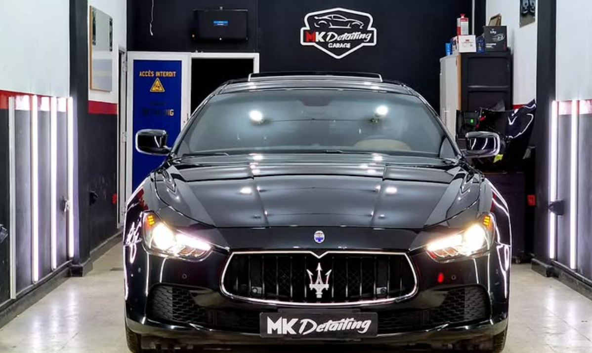

# 🚗✨ MK Detailing Garage — Site vitrine Next.js

Bienvenue sur le site vitrine officiel de **MK Detailing Garage**, expert en detailing automobile : correction peinture, polissage, vitres teintées, accessoires high-tech et protections carrosserie.

Ce projet offre un design moderne, immersif et premium, inspiré de l’univers automobile haut de gamme. Il est conçu pour être accessible, performant et SEO-friendly.

---

## 🌟 Aperçu



---

## 🛠️ Technologies

- **Next.js (App Router)** — Framework React pour sites modernes et SEO
- **TypeScript** — Sécurité et robustesse
- **CSS Modules** — Styles scoped, modulaires et maintenables
- **Google Fonts (Geist)** — Police accessible et élégante
- **FormSubmit** — Envoi de formulaires sans backend
- **Accessibilité renforcée** — Contrastes, navigation clavier, responsive mobile-first

---

## 💡 Fonctionnalités

- 🎯 Hero section impactante avec CTA
- 🧾 Storytelling détaillé et immersif
- 📸 Galerie compacte (peu de photos, mais optimisée)
- ✉️ Formulaire de contact (nom, prénom, téléphone, message) relié à FormSubmit
- 📱 Menu responsive avec burger sur mobile
- ⚡ SEO et metadata (title, description, favicon)
- 🚀 Navigation fluide et transitions rapides

---

## 🚀 Installation locale

```bash
# Clonez le repo
git clone https://github.com/votre-utilisateur/mk-detailing-garage.git

# Entrez dans le dossier
cd mk-detailing-garage

# Installez les dépendances
npm install

# Lancez le serveur de dev
npm run dev
```

Le site sera accessible sur **http://localhost:3000**.

---

## 🏁 Déploiement

Le projet est prêt à être déployé sur **Vercel** (recommandé pour Next.js), ou toute autre plateforme compatible (Netlify, AWS, etc.).

### Déploiement sur Vercel

1. Créez un compte sur [vercel.com](https://vercel.com).
2. Connectez votre repo GitHub.
3. Vercel détectera automatiquement le framework Next.js.
4. Cliquez sur **Deploy**.
5. Une URL publique sera générée automatiquement.

🎯 **Tips** : Pour configurer FormSubmit ou d’autres services externes, ajoutez les variables d’environnement via le dashboard Vercel.

---

## 📁 Structure

```
/app
  └ page.tsx         → Page d'accueil
/components
  └ Header/
  └ Hero/
  └ Story/
  └ ContactForm/
/public
  └ images/
    └ favicon.jpg
    └ autres visuels
  └ cover.jpg        → Aperçu pour README
```

---

## 🎨 Design & accessibilité

- Couleurs principales : **noir accessible**, **rouge profond accessible**, gris neutre
- Police : **Geist Sans** (Google Fonts via `next/font`)
- Layout **mobile-first**, 100% responsive
- Respect des standards WCAG (contrastes, focus, aria)

---

## ❤️ Crédits

Développé par **Aghiles BELKALEM**, en collaboration avec **MK Detailing Garage**.  
Design inspiré par la passion du detailing et l'univers premium automobile.

---

## 🤝 Contribuer

Les contributions sont bienvenues !  
✅ Forkez le repo  
✅ Créez une branche feature  
✅ Faites une pull request

---

## 📞 Contact

📧 contact@mkdetailinggarage.com  
📸 [Instagram MK Detailing Garage](https://www.instagram.com/mk_detailing_garage/)

---

## ⚖️ Licence

MIT © Aghiles BELKALEM